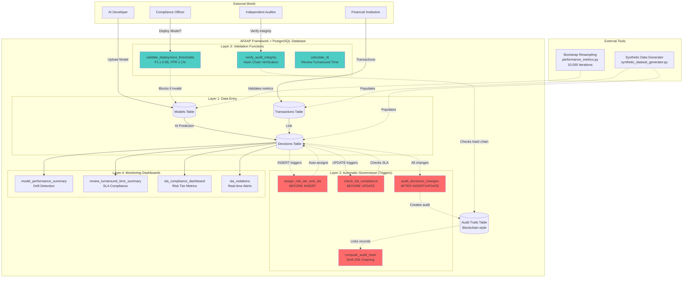
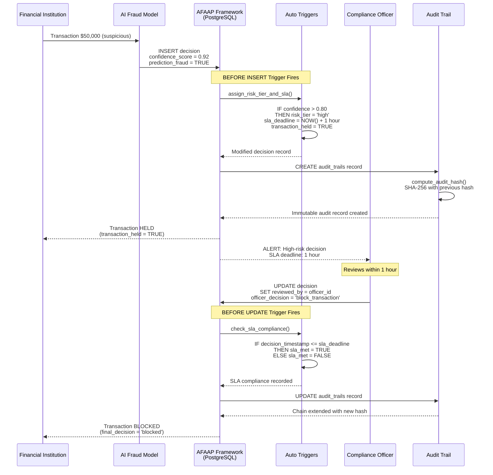
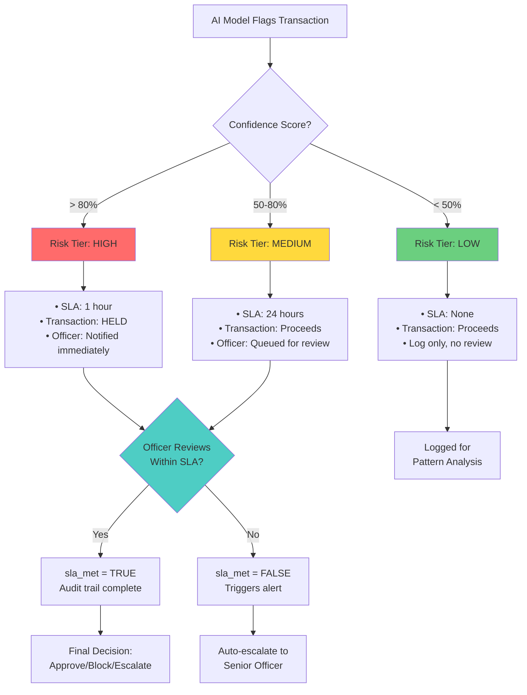
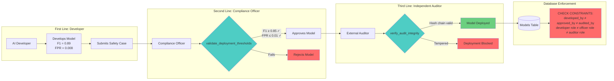

# AFAAP Framework Architecture

## Overview

The AFAAP (AI Financial Accountability and Auditability Protocol) framework is a **database-enforced governance system** that automatically ensures AI models comply with regulatory requirements at the data layer, not the application layer.

---

## System Architecture



---

## Governance Workflow: High-Risk Decision



---

## Risk Stratification Logic



---

## Three Lines of Defense Enforcement



---

## Audit Trail: Blockchain-Style Hash Chaining

```mermaid
flowchart LR
    subgraph "Record 1"
        R1[Decision INSERT<br/>transaction_id: 001<br/>prediction: fraud]
        H1[Previous: NULL<br/>Current: SHA256<br/>a3f2...c91d]
    end

    subgraph "Record 2"
        R2[Decision UPDATE<br/>reviewed_by: officer_5<br/>decision: block]
        H2[Previous: a3f2...c91d<br/>Current: SHA256<br/>7b8e...4fa2]
    end

    subgraph "Record 3"
        R3[Model UPDATE<br/>status: deployed<br/>approved_by: auditor_1]
        H3[Previous: 7b8e...4fa2<br/>Current: SHA256<br/>e5c1...9ad7]
    end

    R1 --> H1
    H1 -.->|Links to next| R2
    R2 --> H2
    H2 -.->|Links to next| R3
    R3 --> H3

    H3 --> VERIFY[verify_audit_integrity]
    VERIFY --> CHECK{Recompute<br/>all hashes<br/>& verify chain}
    CHECK -->|Valid| PASS[✓ Audit trail<br/>tamper-proof]
    CHECK -->|Broken| FAIL[✗ Tampering<br/>detected]

    style VERIFY fill:#4ecdc4
    style PASS fill:#6bcf7f
    style FAIL fill:#ff6b6b
```



---

## Performance Metrics: Bootstrap Resampling

```mermaid
flowchart TD
    START[Model Training Complete] --> EVAL[Evaluate on Test Set<br/>10,000 transactions]

    EVAL --> F1_POINT[Point Estimate:<br/>F1 = 0.87]

    F1_POINT --> BOOT_START[Bootstrap Resampling<br/>10,000 iterations]

    BOOT_START --> ITER[For each iteration:]
    ITER --> SAMPLE[1. Random sample with replacement<br/>n = 10,000]
    SAMPLE --> CALC[2. Calculate F1 score<br/>for this sample]
    CALC --> STORE[3. Store F1 value]

    STORE --> LOOP{Iteration < 10,000?}
    LOOP -->|Yes| ITER
    LOOP -->|No| CI[Calculate 95% CI:<br/>2.5th percentile = 0.851<br/>97.5th percentile = 0.889]

    CI --> RESULT[Final Result:<br/>F1 = 0.87<br/>95% CI: [0.851, 0.889]]

    RESULT --> VALIDATE{F1 ≥ 0.85<br/>AND<br/>lower bound ≥ 0.85?}

    VALIDATE -->|Yes| PASS[✓ Meets Threshold<br/>Deployment Approved]
    VALIDATE -->|No| FAIL[✗ Fails Threshold<br/>Deployment Blocked]

    style BOOT_START fill:#ffd93d
    style VALIDATE fill:#4ecdc4
    style PASS fill:#6bcf7f
    style FAIL fill:#ff6b6b
```

---

## What Makes This a "Framework"

### Traditional Application-Layer Governance (What We DIDN'T Build)

```
❌ Python/Node.js API with governance logic
❌ Middleware checking permissions
❌ Application code enforcing SLA
❌ Cron jobs calculating drift
❌ Separate audit service
```

### Database-Layer Governance (What We BUILT)

```
✅ PostgreSQL triggers auto-enforce risk tiers
✅ CHECK constraints prevent bad data entry
✅ Functions validate before deployment
✅ Materialized views auto-update dashboards
✅ Hash chaining happens automatically
```

**Why Database-Layer?**

1. **Impossible to bypass**: Application bugs can't circumvent governance
2. **ACID guarantees**: Transactions are atomic, consistent, isolated, durable
3. **Single source of truth**: No sync issues between app and database
4. **Performance**: Indexes and materialized views are optimized
5. **Regulatory compliance**: Immutable audit trail at data layer

---

## File Mapping to Design Document

| Design Doc Section | Implementation File | What It Does |
|-------------------|---------------------|--------------|
| **3.1** Three Lines of Defense | [schema/001_initial_schema.sql](../schema/001_initial_schema.sql) | Models table with `developed_by`, `approved_by`, `audited_by` foreign keys to users with role constraints |
| **3.2.2** Risk Stratification | [schema/004_risk_stratification_and_sla.sql](../schema/004_risk_stratification_and_sla.sql) | Trigger assigns high/medium/low based on confidence, sets SLA (1hr/24hr/none), holds transaction if high-risk |
| **4.1** Performance Thresholds | [schema/003_indexes_and_constraints.sql](../schema/003_indexes_and_constraints.sql) | `validate_deployment_thresholds()` function checks F1 ≥ 0.85, FPR ≤ 1% |
| **4.3.1** Audit Trail Completion | [schema/002_audit_trail_extensions.sql](../schema/002_audit_trail_extensions.sql) | SHA-256 hash chaining, `verify_audit_integrity()` function |
| **4.3.2** Review Turnaround Time | [schema/004_risk_stratification_and_sla.sql](../schema/004_risk_stratification_and_sla.sql) | `calculate_rtt()` function, materialized view for ≤ 5 days metric |
| **4.4.1** Bootstrap Resampling | [metrics/performance_metrics.py](../metrics/performance_metrics.py) | 10,000 iterations, 95% CI for F1 and FPR |
| **3.1.1, 4.4.3** Explainability | [schema/004_risk_stratification_and_sla.sql](../schema/004_risk_stratification_and_sla.sql) | `model_explanation` TEXT field for SHAP output |

---

## Key Governance Mechanisms

### 1. Automatic Risk Stratification

**Trigger:** `trigger_assign_risk_tier` (BEFORE INSERT on decisions)

```sql
IF confidence_score > 0.80 THEN
    risk_tier := 'high'
    sla_deadline := created_at + INTERVAL '1 hour'
    transaction_held := TRUE
ELSIF confidence_score >= 0.50 THEN
    risk_tier := 'medium'
    sla_deadline := created_at + INTERVAL '24 hours'
    transaction_held := FALSE
ELSE
    risk_tier := 'low'
    sla_deadline := NULL
    transaction_held := FALSE
END IF
```

### 2. SLA Compliance Checking

**Trigger:** `trigger_check_sla_compliance` (BEFORE UPDATE on decisions)

```sql
IF reviewed_by IS NOT NULL AND sla_deadline IS NOT NULL THEN
    IF decision_timestamp <= sla_deadline THEN
        sla_met := TRUE
    ELSE
        sla_met := FALSE
    END IF
END IF
```

### 3. Threshold Validation

**Function:** `validate_deployment_thresholds(model_id UUID)`

```sql
SELECT f1_score, fpr FROM models WHERE model_id = p_model_id;

IF f1_score < 0.85 THEN
    failing_criteria := array_append(failing_criteria, 'F1 score below 0.85')
END IF

IF fpr > 0.01 THEN
    failing_criteria := array_append(failing_criteria, 'FPR above 1%')
END IF

RETURN (is_valid, failing_criteria, message)
```

### 4. Audit Hash Chaining

**Function:** `compute_audit_hash()`

```sql
-- Get previous hash
SELECT current_audit_hash INTO v_previous_hash
FROM audit_trails
WHERE table_name = p_table_name
ORDER BY created_at DESC
LIMIT 1;

-- Compute new hash: SHA-256(table | record_id | previous_hash)
v_hash_input := p_table_name || '|' || p_record_id || '|' || COALESCE(v_previous_hash, '');
v_current_hash := encode(digest(v_hash_input, 'sha256'), 'hex');

RETURN (v_previous_hash, v_current_hash)
```

---

## Verification Commands

### Check Three Lines of Defense

```sql
SELECT
    m.name,
    r_dev.role_name as developer,
    r_off.role_name as officer,
    r_aud.role_name as auditor
FROM models m
JOIN users u_dev ON m.developed_by = u_dev.user_id
JOIN users u_off ON m.approved_by = u_off.user_id
JOIN users u_aud ON m.audited_by = u_aud.user_id
JOIN roles r_dev ON u_dev.role_id = r_dev.role_id
JOIN roles r_off ON u_off.role_id = r_off.role_id
JOIN roles r_aud ON u_aud.role_id = r_aud.role_id
WHERE m.status = 'deployed';
```

### Check Risk Stratification

```sql
SELECT
    risk_tier,
    COUNT(*) as decisions,
    MIN(confidence_score) as min_confidence,
    MAX(confidence_score) as max_confidence
FROM decisions
GROUP BY risk_tier;
```

### Check Audit Integrity

```sql
SELECT * FROM verify_audit_integrity('decisions',
    (SELECT decision_id FROM decisions LIMIT 1)::TEXT
);
```

### Check SLA Compliance

```sql
SELECT * FROM sla_compliance_dashboard;
SELECT * FROM review_turnaround_time_summary;
SELECT * FROM sla_violations LIMIT 10;
```

---

## Summary

**The AFAAP framework is a governance-as-code system embedded in PostgreSQL.**

It doesn't rely on application logic that can be bypassed. Instead:

- **Triggers** automatically enforce rules on every data change
- **Functions** validate before critical operations
- **Constraints** prevent invalid data from entering
- **Materialized views** provide real-time dashboards
- **Hash chaining** creates an immutable audit trail

When a financial institution uses AFAAP:

1. AI models **can't be deployed** unless F1 ≥ 0.85 and FPR ≤ 1%
2. High-risk decisions **automatically hold transactions** and notify officers
3. SLA compliance is **tracked automatically** (met/missed)
4. Audit trails are **tamper-proof** via cryptographic chaining
5. Three Lines of Defense **can't be bypassed** (database enforces role separation)

**This is what makes it a framework**: governance is structural, not procedural.
